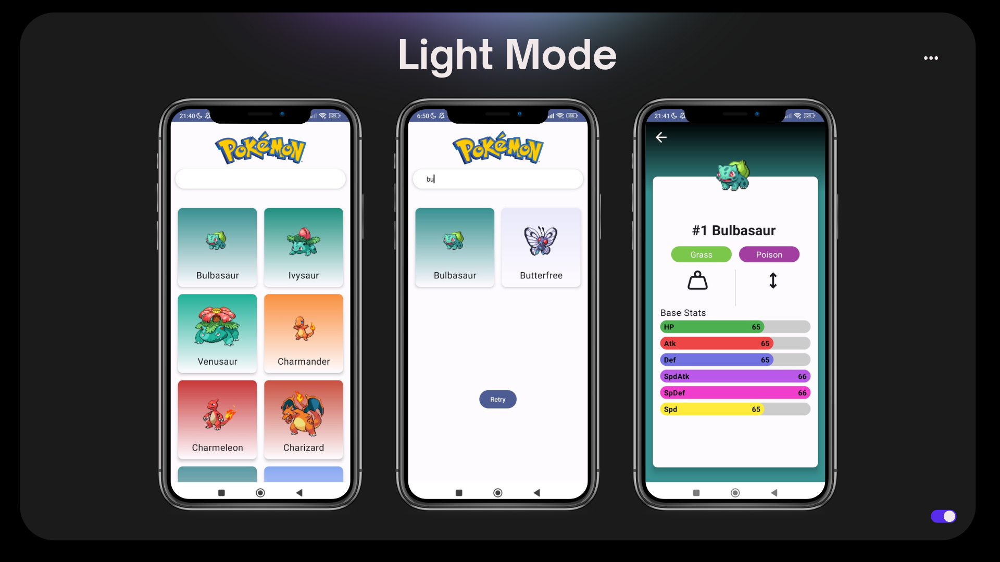
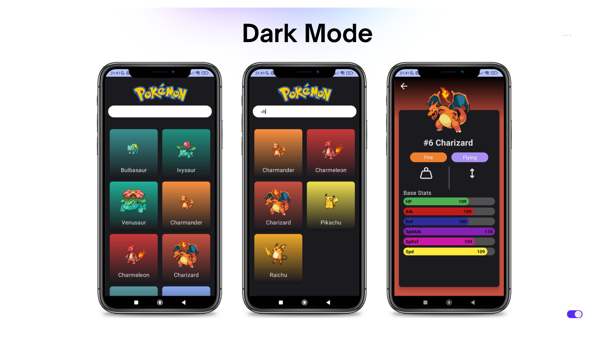

# PokemonApp
Pokemon App is an application using compose as a base view and Kotlin. This application can display a list of Fire pokemon. Here I apply pagination and also create a background whose color matches the image that appears. The Search feature can be used to search for the name of the targeted Pokemon. Equipped with dark mode and bright mode

## Preview 

     
      

